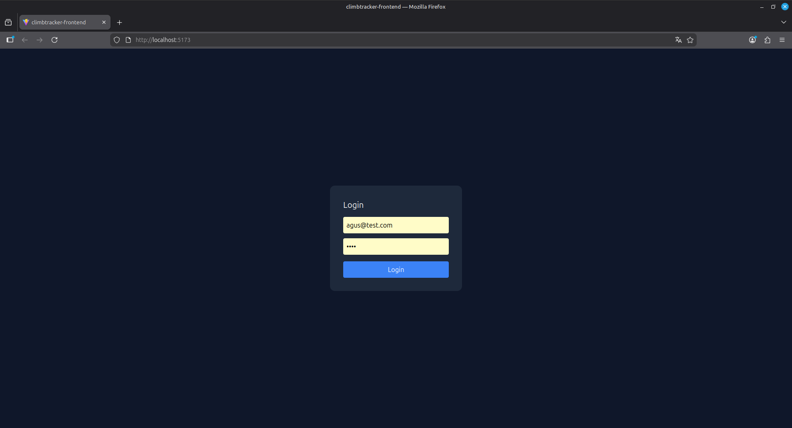
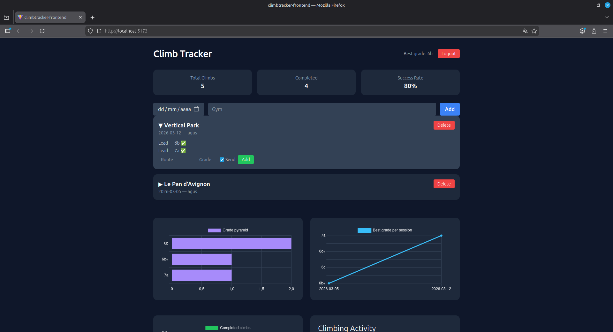
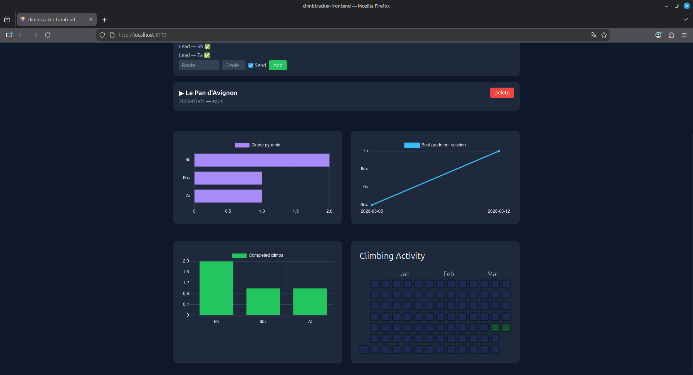
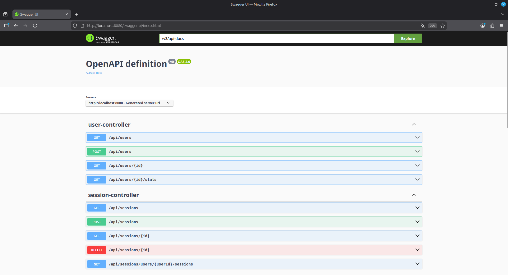

# 🧗 Climbing Session Tracker

Full-stack application for tracking climbing sessions, routes, and performance progression.

Built with a **Spring Boot REST API** and a **React + TypeScript dashboard**, including **JWT authentication** and interactive climbing analytics.

---

## Tech Stack

**Backend**

* Java 21
* Spring Boot
* Spring Security
* JWT Authentication
* JPA / Hibernate
* Maven

**Frontend**

* React
* TypeScript
* Vite
* TailwindCSS
* Chart.js / Recharts

**Database**

* PostgreSQL (production)
* H2 (development)

---

## Key Features

### Authentication

Secure login system using **JWT tokens**.

* token-based authentication
* protected API endpoints
* secure frontend requests

---

### Session Management

Track climbing sessions including:

* gym name
* date
* logged climbs

Each session can contain multiple climbs.

---

### Climb Logging

For each climb you can record:

* route name
* grade
* completion status

Example:

Blue Wall — 6a ✓
Red Route — 7a ✗

---

### Analytics Dashboard

The application provides several climbing analytics visualizations:

* Grade Pyramid
* Best Grade per Session
* Completed Climbs Distribution
* Climbing Activity Heatmap

These allow climbers to visualize their progress over time.

---

# Application Preview

## Session Management



---

## Dashboard





---

## Swagger UI (local)



---

# Project Architecture

```
climbing-session-tracker
│
├── backend
│   └── Spring Boot REST API
│
├── climbtracker-frontend
│   └── React + TypeScript dashboard
│
└── README.md
```

---

# API Overview

| Method | Endpoint                          | Description         |
| ------ | --------------------------------- | ------------------- |
| POST   | `/api/auth/login`                 | Authenticate user   |
| GET    | `/api/sessions`                   | Get user sessions   |
| POST   | `/api/sessions`                   | Create session      |
| DELETE | `/api/sessions/{id}`              | Delete session      |
| GET    | `/api/climbs/my`                  | Get user's climbs   |
| POST   | `/api/climbs/session/{sessionId}` | Add climb           |
| GET    | `/api/climbs/stats`               | Climbing statistics |

---

# Running the Project

## Clone the repository

```
git clone https://github.com/YOUR_USERNAME/climbing-session-tracker.git
cd climbing-session-tracker
```

---

## Run Backend

```
cd backend
./mvnw spring-boot:run
```

Backend runs on

```
http://localhost:8080
```

---

## Run Frontend

```
cd climbtracker-frontend
npm install
npm run dev
```

Frontend runs on

```
http://localhost:5173
```

---

# Future Improvements

Possible future features:

* climbing grade conversion (Font ↔ V grades)
* user profiles
* outdoor climbing tracking
* gym database
* mobile UI

---

# Author

Agustín Gutiérrez

Electronic Engineer
Full-stack Developer
